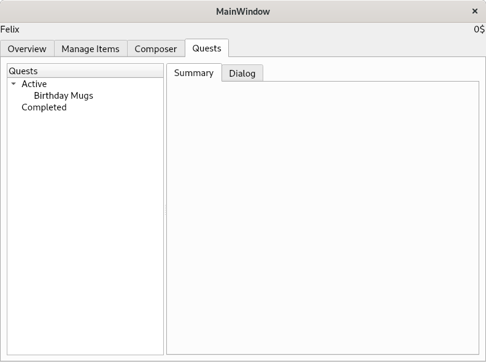

UNFINISHED

### Description:

This is a plugin for the flash card program "Anki". It aims to gameify the learning experience by rewarding the learner with random items, for learning cards.
Those items can than be sold, combined or broken down into components. 
With these items, the players goal is to complete quests.

The project does not yet integrate with anki. Basic item management, quests and crafting are implemented.

### How to start
Run main.py with using python3.

### Requirements:

PyQt5, ply, html5lib

